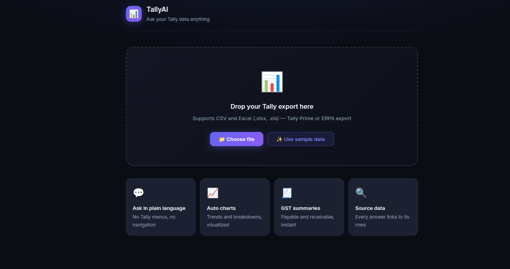
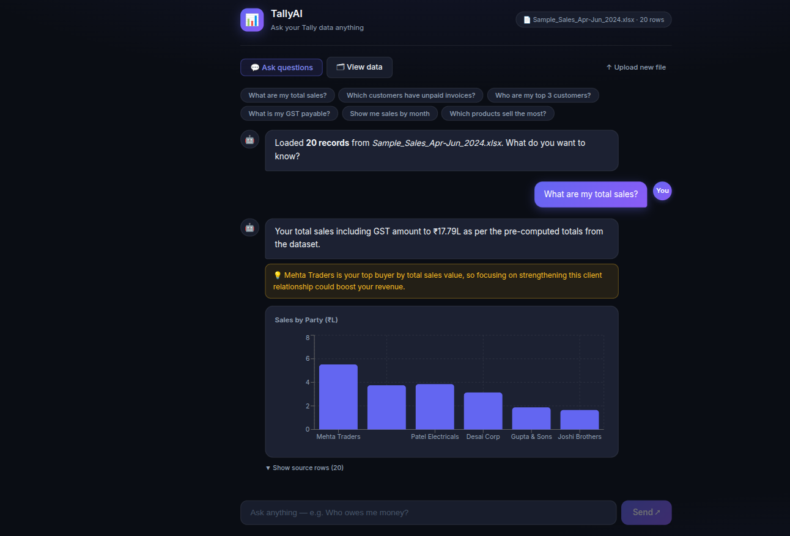

# TallyAI — AI Assistant for Tally Users

TallyAI is an AI-powered assistant that helps Tally users interact with their business data using natural language.

Instead of navigating multiple reports or manually analyzing Excel files, users can upload a Tally CSV or Excel export and ask questions like:

- Who hasn't paid me yet?
- What were my total sales last month?
- Which products generated the highest revenue?
- Show my monthly sales trend.

The goal is simple: **make financial information easier to understand without changing how businesses already use Tally.**

---

## 📸 Application Preview

### Home Screen -



### Chat Interface



Ask questions in plain English and receive business insights, charts, and supporting source records.

## Why TallyAI?

Small and medium businesses rely heavily on Tally, but getting business insights usually involves:

- Opening multiple reports
- Exporting data into Excel
- Filtering and sorting manually
- Asking an accountant for reports

TallyAI simplifies this workflow.

```text
Export from Tally
        │
        ▼
Upload CSV / Excel
        │
        ▼
Ask Questions in Plain English
        │
        ▼
Get Business Answers + Charts + Source Records
```

---

## Features

- 📁 Upload Tally CSV or Excel files
- 💬 Ask business questions in natural language
- 📊 AI-generated business insights
- 📈 Interactive charts and tables
- 📄 Source records for every answer
- ⚡ Retrieval-Augmented Generation (RAG) for accurate responses

---

## Tech Stack

| Layer           | Technology        |
| --------------- | ----------------- |
| Frontend        | React             |
| Backend         | FastAPI           |
| Data Processing | Pandas            |
| AI Framework    | LangChain         |
| Vector Database | ChromaDB          |
| Embeddings      | OpenAI Embeddings |
| LLM             | OpenAI GPT        |

---

## System Architecture

The application follows a **Retrieval-Augmented Generation (RAG)** architecture.

Instead of sending the complete Tally export to the language model, only the records related to the user's question are retrieved first. This keeps responses faster, more accurate, and scalable even for large datasets.

📖 **Read more:** [Solution Architecture](docs/architecture.md)

>

---

## Project Structure

```text
tally-ai/
│
├── backend/
├── frontend/
│
├── docs/
│   ├── architecture.md
│   ├── product-thinking.md
│   ├── product-ownership.md
│   └── setup.md
│
├── screenshots/
│   ├── architecture.png
│   ├── home.png
│   ├── upload.png
│   └── answer.png
│
├── README.md
├── LICENSE
└── .gitignore
```

---

## Quick Start

### Clone the Repository

```bash
git clone <repository-url>
cd tally-ai
```

### Backend

```bash
cd backend

python -m venv .venv

# Linux / macOS
source .venv/bin/activate

# Windows
.venv\Scripts\activate

pip install -r requirements.txt

cp .env.example .env

# Add your OpenAI API key

uvicorn main:app --reload
```

### Frontend

```bash
cd frontend

npm install

npm start
```

The application will be available at:

- Frontend → http://localhost:3000
- Backend → http://localhost:8000

📖 **Complete installation guide:** [Setup Guide](docs/setup.md)

---

## Example Questions

After uploading a Tally export, try asking:

- What are my total sales?
- Who hasn't paid me yet?
- Show sales by month.
- Which customers generated the highest revenue?
- Which products performed the best?
- What is my GST payable?

---

## Documentation

Detailed documentation is available in the **docs** folder.

- 📄 [Product Thinking](docs/product-thinking.md)
- 🏗️ [Solution Architecture](docs/architecture.md)
- 📈 [Product Ownership](docs/product-ownership.md)
- 🚀 [Setup Guide](docs/SETUP.md)

---

## Future Improvements

- Direct Tally integration
- User authentication
- Persistent workspaces
- Multi-company support
- GST filing assistant
- WhatsApp interface
- Scheduled business reports
- Predictive business insights

---

## Author

**Narendra Patel**

Built as part of the **199 Developments – Product Engineer Assessment**.
