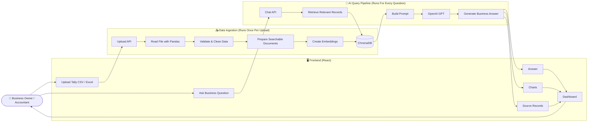

# Part 2 — Solution Design

# TallyAI System Architecture

## Architecture Diagram

---

# Architecture Overview

The system is divided into two independent pipelines:

- **Data Ingestion Pipeline** (runs only once after uploading a file)
- **Query Pipeline** (runs every time the user asks a question)

Separating these pipelines improves performance because the uploaded file is processed only once, while users can ask unlimited questions without reprocessing the data.

---

# 1. Data Ingestion Pipeline

This pipeline starts when the user uploads a Tally CSV or Excel file.

The backend:

- Reads the file using Pandas.
- Validates the uploaded data.
- Cleans missing or inconsistent values.
- Converts the data into searchable documents.
- Creates vector embeddings.
- Stores them in ChromaDB.

Since this work happens only once, future questions become much faster.

---

# 2. Query Pipeline

After the upload is complete, users can ask questions like:

- Show sales for last month.
- Which customers have unpaid invoices?
- What are my top-selling products?

The backend:

1. Receives the question.
2. Finds the most relevant records from ChromaDB.
3. Combines those records with the user's question.
4. Sends both to OpenAI GPT.
5. Returns a business-friendly answer.

---

# 3. Response Layer

Instead of returning raw data, the application presents information in a way that is useful for business users.

Every response may include:

- A natural language explanation
- Charts or KPIs
- Detailed tables
- Source records used to generate the answer

Showing the source records helps users verify the AI's answer before making business decisions.

---

# Why I Chose This Architecture

### Simple for users

Business owners already know how to export reports from Tally.

Instead of asking them to install connectors or configure APIs, the product simply accepts CSV or Excel files.

This reduces onboarding time and keeps the MVP easy to use.

---

### Separate responsibilities

Each component has only one job.

| Component  | Responsibility                 |
| ---------- | ------------------------------ |
| React      | User interface                 |
| FastAPI    | APIs and application logic     |
| Pandas     | Read and prepare Tally files   |
| ChromaDB   | Store and search business data |
| OpenAI GPT | Generate business insights     |

This makes the application easier to maintain and extend.

---

### Easy to scale

The architecture is modular.

In the future, manual file uploads can be replaced with direct Tally integration without changing the AI pipeline.

This reduces future development effort.

---

### Build trust

Financial applications require trust.

Instead of giving only an AI-generated answer, the application also displays the source records used to generate the response.

This allows users to verify the results before making decisions.

---

# Why RAG?

A typical Tally export may contain thousands of transactions.

Sending the entire file to the language model for every question would:

- Increase response time.
- Increase API cost.
- Reduce accuracy because irrelevant data is included.

Retrieval-Augmented Generation (RAG) solves this by first finding only the records related to the user's question and then sending only that relevant context to the language model. This improves factual grounding and reduces hallucinations while keeping responses efficient.

---

# How This Architecture Supports Business Goals

| Business Goal                   | Architecture Decision                                                                                 |
| ------------------------------- | ----------------------------------------------------------------------------------------------------- |
| Get answers quickly             | Data is processed once and reused for future questions.                                               |
| Reduce manual report generation | Users upload a file once and ask unlimited questions.                                                 |
| Improve answer accuracy         | RAG retrieves only relevant records before generating a response.                                     |
| Build user trust                | Every answer includes supporting source records.                                                      |
| Keep infrastructure simple      | React, FastAPI, ChromaDB, and OpenAI are sufficient for the MVP.                                      |
| Support future growth           | Direct Tally integration and multi-company support can be added without redesigning the architecture. |

---

# Future Improvements

- Direct Tally Prime integration
- User authentication and saved workspaces
- Multiple company support
- Scheduled AI-generated business reports
- Predictive business insights
- GST filing assistant
